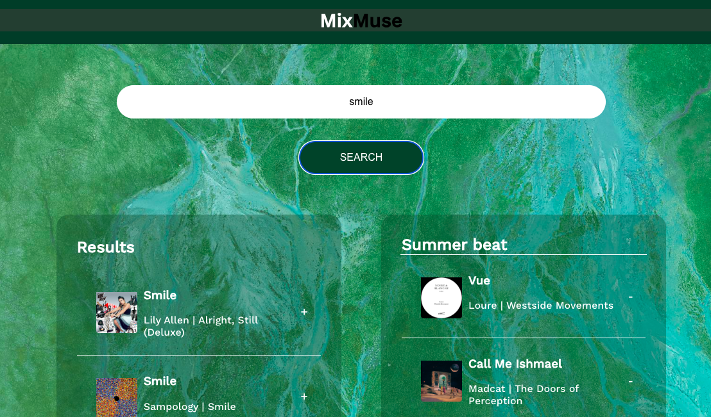

🎧 MixMuse — Listening Queue Feature
🎯 Objective
Enhance user experience by allowing users to queue multiple track in a temporary, session-based Listening Queue before adding them to a playlist.

📚 Background
Currently, MixMuse enables users to search tracks and add them directly to playlists. However, curating playlists—especially around moods or themes—often requires multiple tracks in sequence before making final choices.

The Listening Queue mimics Spotify’s "Add to Queue" feature, letting users preview tracks in order, offering more intentional playlist building without saving anything to their Spotify account.

Key Capabilities

Queue tracks for temporary playlists.

Inline queue controls: “Add,” “Remove".

Session-persistent queue (until refresh or navigation).

Displays:

Track title, artist, album covers.

Inline queue actions: add, remove
